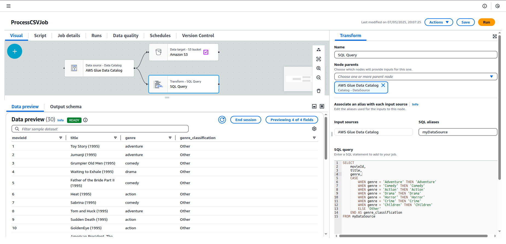

# CSV Data Pipeline using AWS (S3, Lambda, Glue, QuickSight)

This project demonstrates a data pipeline built using various AWS services to process a movie dataset stored in CSV format. The pipeline consists of uploading the raw data to Amazon S3, preprocessing it using AWS Lambda, transforming it with AWS Glue, and finally visualizing the processed data in Amazon QuickSight. The dataset primarily contains information about movies, including various attributes such as movie genre, title, and year, allowing for meaningful analysis of movie trends, genres, and other related insights.

## Architecture Diagram

## Technology Used
1. Programming Language - Python
2. Scripting Language - SQL
3. AWS
   - lambda
   - S3
   - AWS Glue
   - IAM
   - QuickSight

## Project Workflow
1. Source CSV File
   
   The process begins when I manually uploads a CSV file to the source S3 bucket, named "csv-raw-data-bucket". This bucket acts as the initial storage point for raw, unprocessed data.

2. Lambda Trigger & Preprocessing
   
   The S3 upload event triggers an AWS Lambda function, which:
    - Reads the raw CSV file.
    - Performs necessary preprocessing.
    - Saves the processed output to another S3 bucket "csv-processed-data-bucket"

3. Glue Crawler & ETL Job
   
   Glue Crawler
      An AWS Glue Crawler is configured to scan the "csv-processed-data-bucket". When run:

      It automatically detects the schema of the processed CSV data.

      It creates or updates a table in the AWS Glue Data Catalog, making the data queryable using services like Glue, Athena, or Redshift Spectrum.

   Glue ETL Job
      After the crawler finishes, a Glue ETL job is triggered. This job uses the Visual ETL editor, where only SQL-based transformations are applied—no PySpark or Python scripts are involved.

      Within this job, it can:

   - Run SELECT queries with filters or joins.

   - Aggregate data (e.g., GROUP BY operations).

   - Create derived columns or remove unnecessary ones.
     
      

     The transformed dataset is then saved into a third S3 bucket named "csv-final-data-bucket", which stores the final, analysis-ready data.

4. Visualization in QuickSight
   
   Finally, the clean and transformed data in "csv-final-data-bucket" is connected to Amazon QuickSight, AWS’s business intelligence tool.

   Using QuickSight, it can:

   Build interactive dashboards and visualizations (bar charts, tables, pie charts, maps, etc.).

   Share insights with stakeholders.

   Enable data-driven decision-making using real-time dashboards based on your CSV input.

   

   This bar diagram effectively shows the number of movies in each genre, allowing for easy comparison of genre popularity within the dataset.

   The horizontal layout and clear labeling make it an appropriate and insightful choice for this type of categorical data analysis..

   
## IAM Roles and Policies Used

1. Service: Lambda

   IAM Role Name: LambdaExecutionRole

   Key Permissions
   - AmazonS3FullAccess
   - AWSLambdaBasicExecutionRole

2. Service: Glue	

   IAM Role Name: GlueServiceRole

   Key Permissions
   - AWSGlueServiceRole
   - S3FullAccess
   - GlueConsoleFullAccess

3. Service: QuickSight	

   IAM Role Name: QuickSightAccessRole	

   Key Permissions
   - AmazonS3FullAccess

## Troubles Faced & Solutions

1. Lambda Function Errors

   - Time out Error : Increased timeout(run time)to 30 secs. in Lambda configuration.
   - No record error : Created a proper test event that mimics an actual S3 event.

2. Glue Job Errors
    
   - Visual ETL job failed : This was due to the absence of adequate IAM policies
   - Data not appearing in final bucket : Configured the output path explicitly in Glue Job's "S3 Target" settings.

3. QuickSight Errors

   - QuickSight connection issue : Created and uploaded a "manifest.json" into the final s3 bucket.
   

